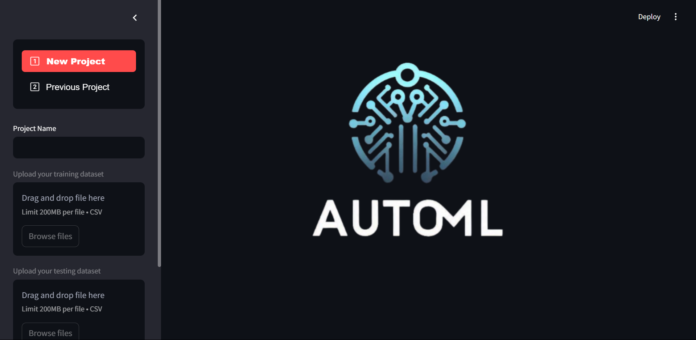
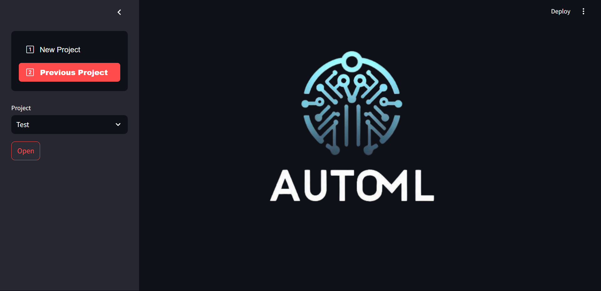
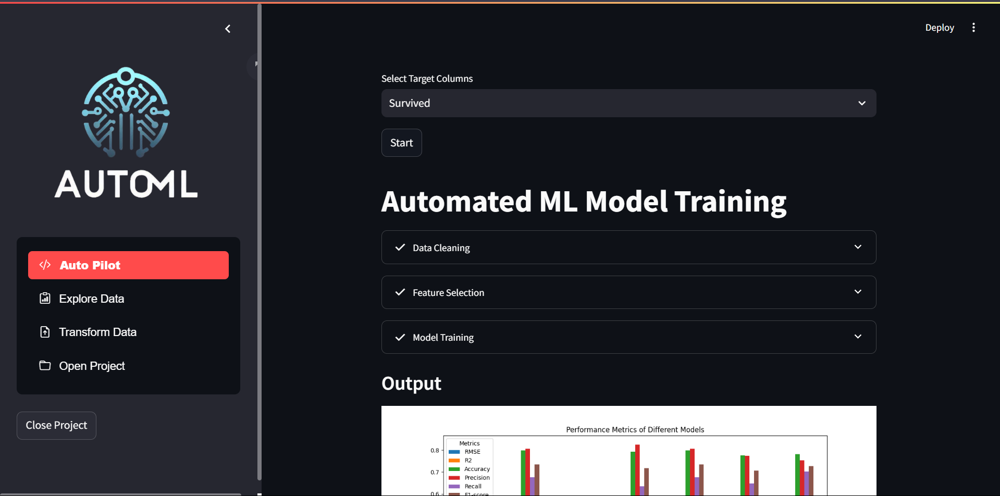
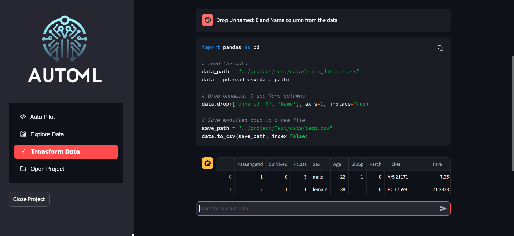
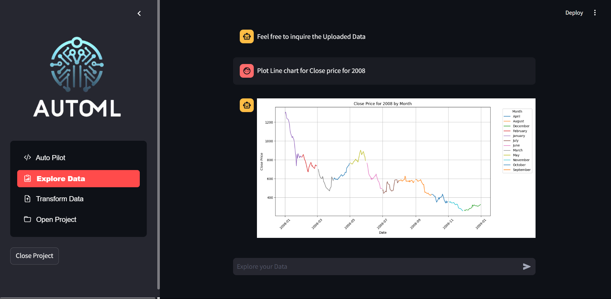
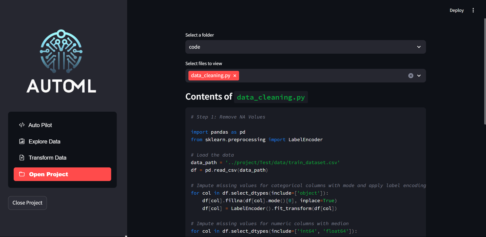

## Project Documentation

### 1. Folder Structure

```
src/
│
├── images/
│   ├── favicon.ico
│   ├── logo.png
│   ├── HomePage.png
│   ├── HomePage2.png
│   ├── Automl.png
│   ├── transform.png
│   ├── explore.png
│   └── openProject.png
│
├── project/
│   └── [Project Name]/
│           ├── data/
│           ├── models/
│           ├── report/
│           └── code/
│
├── src/
│   ├── app.py
│   ├── automl.py
│   ├── explore.py
│   ├── transform.py
│   └── prompt.py
│
├── .env
├── requirements.txt
└── README.md
```

### 2. `.env` File

The `.env` file should be placed in the root of your project directory (`src`) and contain environment variables used by your application. For example:

```env
OPENAI_API_KEY=your_openai_api_key_here
```

Replace `your_openai_api_key_here` with your actual OpenAI API key.

### 3. `requirements.txt`

The `requirements.txt` file lists all Python packages your project depends on. Here’s an example based on your provided code:

```txt
# Application
streamlit
llama-index-llms-openai
python-dotenv
pandasai

# Data manipulation
pandas
numpy

# Machine learning
scikit-learn
xgboost
lightgbm
catboost

# Statistics
scipy

# Plotting
matplotlib
seaborn

# For running the code
joblib
```

### 4. Running Steps

#### **1. Clone the Git Repository**

   Start by cloning your Git repository to your local machine:

   ```bash
   git clone https://github.com/Prem07a/AUTOML.git
   cd AUTOML
   ```

#### **2. Create and Activate a Virtual Environment**

   For macOS and Linux:

   ```bash
   python3 -m venv venv
   source venv/bin/activate
   ```

   For Windows:

   ```bash
   python -m venv venv
   venv\Scripts\activate
   ```

   This step creates a virtual environment and activates it to ensure that dependencies are installed in an isolated environment.

#### **3. Install the Required Packages**

   With the virtual environment activated, install the necessary Python packages listed in `requirements.txt`:

   ```bash
   pip install -r requirements.txt
   ```

   This command installs all the dependencies required for your project.

   *Note: If you encounter issues installing `pandasai`, ensure that you are using Python 3.11.9 or later.*

#### **4. Run Your Streamlit App**

   After setting up the environment and installing dependencies, you can start your Streamlit app. Navigate to the `src` directory and run:

   ```bash
   streamlit run app.py
   ```

   This command launches the Streamlit server and opens your app in the default web browser.

### 5. Project Screenshots

Here are some screenshots of the different pages in the application:

#### **Home Page**



#### **Home Page 2**



#### **AutoML Page**



#### **Transform Page**



#### **Explore Page**



#### **Open Project Page**



